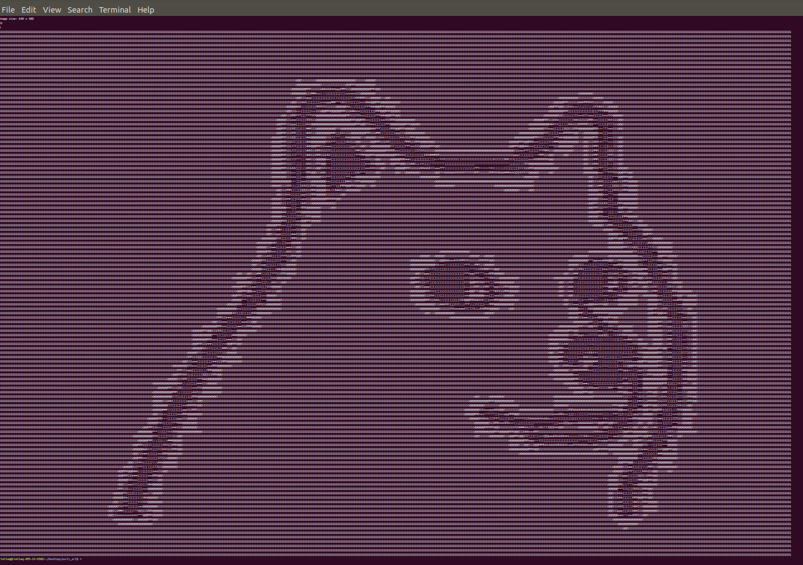

# ascii_art
Program that generates ASCII art that prints to Terminal using an image and the Python Imaging Library (Pillow). Based on Robert Heaton's [tutorial](https://robertheaton.com/2018/06/12/programming-projects-for-advanced-beginners-ascii-art/)

Sample Image:

Screenshot of Program Output:

